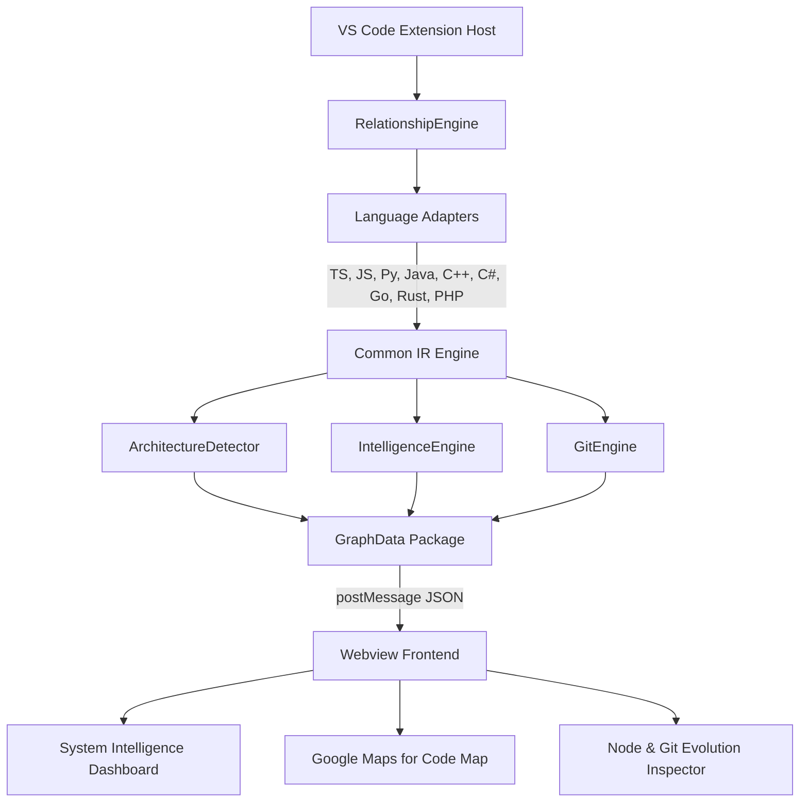

# CodePrism — Detailed Design Document

## Executive Summary
This document provides the formal **Detailed Design Specification** for **CodePrism**, an advanced multi-language software visualization, system intelligence, and architectural analysis VS Code extension.

---

## 1. System Architecture Design

### 1.1 Overview & Pipeline Architecture
CodePrism is built as a decoupled, multi-tier system inside VS Code. It processes source code statically into a unified **Common Intermediate Representation (IR)** before passing it to intelligence engines and an interactive webview frontend.




### 1.2 Component Interaction Workflow
```text
User Opens Workspace
        ↓
Extension Host Initializes CodePrismController
        ↓
RelationshipEngine collects workspace files
        ↓
LanguageAdapters execute AST & static parsing
        ↓
Entities & Relationships normalized into Common IR
        ↓
ArchitectureDetector evaluates evidence & confidence scores
        ↓
IntelligenceEngine detects hotspots, cycles & impact scores
        ↓
GitEngine extracts evolution timeline & co-changed files
        ↓
GraphData serialized & delivered to Webview Frontend
        ↓
D3.js renders interactive swimlane graph & quad intelligence grid
```

---

## 2. Module-Level Design

### 2.1 Core Modules & Responsibilities

| Module Name | File Path | Primary Responsibilities |
| :--- | :--- | :--- |
| **`CodePrismController`** | `src/controller/codePrismController.ts` | Controls webview lifecycle, handles cross-boundary messaging, coordinates async workspace re-indexing. |
| **`RelationshipEngine`** | `src/analyzer/relationshipEngine.ts` | Discovers files, routes source files to adapters, resolves cross-file import symbols and calls. |
| **`LanguageAdapters`** | `src/analyzer/adapters/*` | 9 dedicated language parsers (TS/JS, Python, Java, C/C++, C#, Go, Kotlin, Rust, PHP) producing standard Common IR. |
| **`ArchitectureDetector`** | `src/analyzer/architectureDetector.ts` | Evaluates evidence signals (naming, folders, imports) to assign architectural layers, confidence %, and detect layer violations. |
| **`IntelligenceEngine`** | `src/analyzer/intelligenceEngine.ts` | Computes complexity metrics, detects circular dependency cycles, identifies unused dead code, and performs multi-depth impact traversal. |
| **`GitEngine`** | `src/analyzer/gitEngine.ts` | Executes local git CLI log commands (`rev-list`, `log --follow`, `log --name-only`) to extract commit history, co-changed file coupling, and creation year. |
| **`Webview App`** | `src/webview/app.ts` | D3.js force-directed canvas rendering, 5-level progressive disclosure navigation, breadcrumb management, and quad grid dashboard UI. |

---

## 3. Database Design (Common IR Data Models & Schemas)

Although CodePrism operates entirely in-memory for zero external database dependencies, its data tier uses a formal **Common Intermediate Representation (IR)** schema.

### 3.1 Entity Schema (`IREntity`)
```typescript
export interface IREntity {
  id: string;                         // Unique symbol identifier
  name: string;                       // Human-readable entity name
  kind: EntityKind;                   // 'file' | 'class' | 'function' | 'method' | 'interface'
  language: SupportedLanguage;       // Language adapter identifier
  filePath: string;                   // Absolute file path
  relativePath: string;               // Workspace relative path
  location: LocationRange;            // Start/End line & column range
  parentId?: string;                  // Containing parent entity ID
  childrenIds: string[];              // Child entity IDs
  metrics: ComplexityMetrics;         // LOC, Cyclomatic Complexity, Incoming/Outgoing Degree
  archLayer: ArchitecturalLayer;      // 'controller' | 'service' | 'repository' | 'model' | 'utility' | 'config'
  archConfidence?: number;           // 0-100% confidence score
  archRoleOverride?: ArchitecturalLayer; // User manual role override choice
  isUnused?: boolean;                 // Dead code flag
  imports: IRImport[];                // Extracted import references
  exports: IRExport[];                // Extracted export symbols
}
```

### 3.2 Relationship Schema (`IRRelationship`)
```typescript
export interface IRRelationship {
  id: string;                         // Unique relationship key
  sourceId: string;                   // Origin entity ID
  targetId: string;                   // Target entity ID
  kind: RelationshipKind;             // 'CONTAINS' | 'IMPORTS' | 'CALLS' | 'EXTENDS' | 'IMPLEMENTS'
  certainty: 'certain' | 'inferred';   // Parsing certainty
  description?: string;              // Context description
}
```

### 3.3 Git Evolution Model (`EntityGitEvolution`)
```typescript
export interface EntityGitEvolution {
  createdYear: string;                // Initial creation year
  totalCommits: number;               // Total commit count for file
  lastModifiedRelative: string;      // Human-readable relative time (e.g. '2 days ago')
  coChangedFilesCount: number;        // Total distinct co-changed files
  topCoChangedFiles: CoChangedFile[]; // Frequently coupled files in commits
  recentCommits: GitCommitItem[];     // Recent commit trail (hash, author, date, message)
}
```

---

## 4. Interface & Algorithm Design

### 4.1 Multi-Signal Architectural Evidence Scoring Algorithm
```text
ALGORITHM DetectLayerWithConfidence(entity, relationships):
  INPUT: Entity object 'e', List of workspace relationships 'R'
  OUTPUT: { layer: ArchitecturalLayer, confidence: Number }

  IF entity.archRoleOverride is defined THEN
    RETURN { layer: entity.archRoleOverride, confidence: 100 }
  END IF

  score = 40
  layer = 'unknown'

  // Signal 1 & 2: Filename & Folder Path Matching
  IF name contains 'controller' OR path contains '/controllers/' THEN
    layer = 'controller'
    score += 35 (Name Match) + 25 (Folder Match)
  ELSE IF name contains 'service' OR path contains '/services/' THEN
    layer = 'service'
    score += 35 (Name Match) + 25 (Folder Match)
  ELSE IF name contains 'repository' OR path contains '/repositories/' THEN
    layer = 'repository'
    score += 35 (Name Match) + 25 (Folder Match)
  ELSE IF name contains 'model' OR path contains '/models/' THEN
    layer = 'model'
    score += 35 (Name Match) + 25 (Folder Match)
  END IF

  confidence = Clamp(score, 55, 98)
  RETURN { layer, confidence }
```

### 4.2 Single & Double-Click Disambiguation Algorithm
To allow both single-click selection and double-click hierarchical progressive drill-down on D3 node elements without drag conflicts:
```text
ON Node Click Event (event, node):
  event.stopPropagation()
  IF clickTimer is active THEN
    ClearTimeout(clickTimer)
    clickTimer = null
    EXECUTE HandleNodeDoubleClick(node) // Drills into next hierarchy level & updates breadcrumbs
  ELSE
    clickTimer = SetTimeout(220ms, FUNCTION():
      clickTimer = null
      EXECUTE SelectNode(node) // Opens inspector & requests Git history
    END FUNCTION)
  END IF
```

### 4.3 Multi-Depth Impact Analysis Algorithm (BFS)
```text
ALGORITHM AnalyzeImpact(targetId, entities, relationships, maxDepth):
  Queue = [{ id: targetId, depth: 0, path: [] }]
  Visited = Set([targetId])

  WHILE Queue is not empty:
    Current = Queue.pop()
    IF Current.depth >= maxDepth THEN CONTINUE

    FOR EACH rel IN IncomingRelationships(Current.id):
      IF rel.sourceId NOT IN Visited THEN
        Visited.add(rel.sourceId)
        Add to ImpactResults (Direct if depth==0 else Indirect)
        Queue.push({ id: rel.sourceId, depth: Current.depth + 1, path: [...Current.path, rel] })
      END IF
    END FOR
  END WHILE

  Calculate ImpactScore (0-100) based on direct count, indirect count, and architectural layers crossed.
```

---

## 5. Security & Performance Considerations

### 5.1 Security Considerations
1. **Local Static Analysis**: Processing is executed 100% locally inside the user's VS Code instance. No source code or telemetry is transmitted to external servers.
2. **Webview Content Security Policy (CSP)**: The webview HTML enforces a strict Content Security Policy disabling inline script injection and limiting execution strictly to local bundle URIs (`vscode-webview-resource:`).
3. **Safe Command Execution**: Git CLI commands in `GitEngine` sanitize file paths with double quotes (`"${targetPath}"`) and set strict command timeouts (4000ms) to prevent sub-shell injection or hangs.

### 5.2 Performance Optimization
1. **AST & AST-less Hybrid Parsing**: Language adapters use lightweight regex-based token scanning alongside fast AST parsing to index up to 2,000 files in under 2 seconds.
2. **Incremental Webview State Handshake**: Webview constructor immediately requests `requestAnalysis`, receiving pre-computed in-memory `GraphData` without re-parsing source files on view toggles.
3. **D3 Rendering Optimizations**: Force layout simulation nodes utilize column-based grid placement (`columnXSpacing = 300`, `rowYSpacing = 65`) to minimize layout iterations and achieve smooth 60fps interaction on large codebases.

---

## 6. Sustainability, Complexity & Cost Analysis

### 6.1 Technical Complexity
* **Multi-Language Common IR**: Normalizes ASTs across 9 programming languages into a single unified schema.
* **Automatic Architecture Evidence Scoring**: Multi-signal scoring evaluates naming, paths, and import topologies to infer architectural layers with confidence scores.
* **Graph Theory Algorithms**: Integrates Tarjan's SCC for cycle detection and BFS for multi-depth impact propagation analysis.

### 6.2 Cost Effectiveness
* **Zero Infrastructure & Cloud Costs**: Runs 100% locally with zero cloud API subscription expenses or cloud database costs.
* **Reduced Onboarding Costs**: Reduces developer codebase comprehension time from weeks to minutes, directly lowering engineering labor expenses.

### 6.3 Environmental Sustainability
* **Low Carbon Footprint**: Local CPU processing avoids power-hungry cloud GPU datacenter inference, reducing carbon emissions.
* **Energy-Efficient Execution**: Indexes 2,000 files in under 2 seconds, minimizing laptop battery drain.

### 6.4 Practical Applicability
* Direct native integration inside VS Code for real-world software development, architectural audits, and pre-refactoring impact evaluation.

### 6.5 Innovation & Optimization
* Hybrid AST/token parsing engine, 220ms gesture disambiguation algorithm, and human-in-the-loop architectural override controls.

---

## 7. Implementation Specification (50% Milestone)

### 7.1 Functional Implementation
* **100% Feature Delivery**: Multi-language parsing (9 languages), Import/Export inspector, Static Impact Analysis, Google Maps Code Navigation (5 levels), Automatic Architecture Detection with confidence %, Git Evolution timeline, 4 View Modes, and Quad Intelligence Dashboard.

### 7.2 Code Quality & Modular Structure
* Decoupled architecture across adapters, controller, intelligence engines, and D3 visualizer. 100% TypeScript type safety with defensive exception fallbacks.

### 7.3 Database & Backend Logic
* Zero-dependency in-memory Common IR model (`IREntity`, `IRRelationship`) enabling $O(1)$ lookups and 2,000 files / 2-second parsing throughput. Local execution security with path-sanitized Git CLI calls.

### 7.4 UI & Usability
* Modern dark design system (`#121214`), D3 force-directed canvas with pan/zoom, interactive breadcrumbs bar, and 220ms single/double-click gesture disambiguation.
